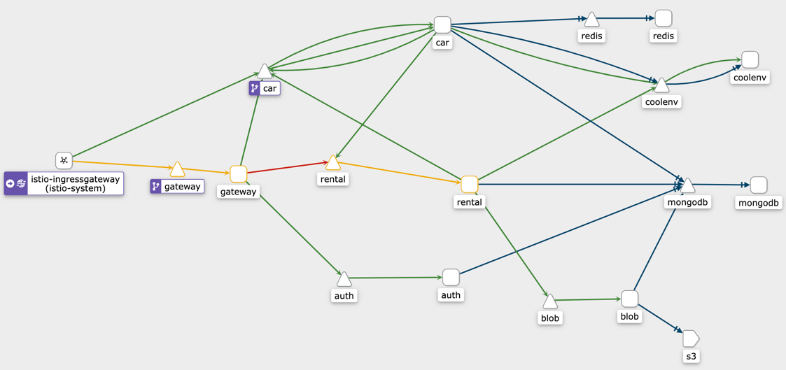
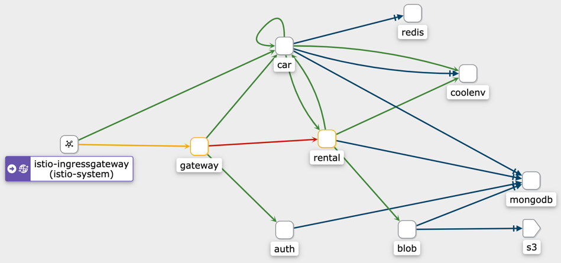
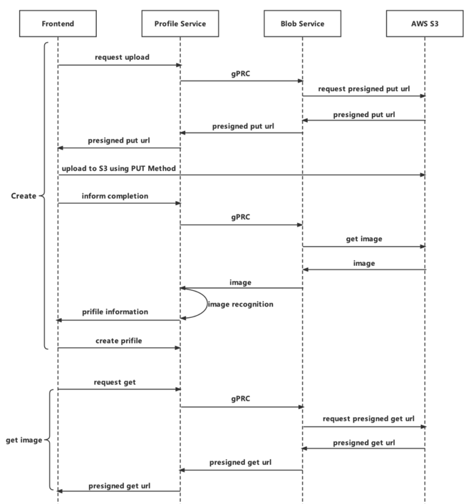

# Car Sharing Rental App

gRPC+MongoDB+RabbitMQ+Docker+Kubernetes+Istio+Websocket+Redis

Apply Domain Driven Design and Microservices Architecture

## Microservices Architecture

## Deployed on Kubernetes (AWS EKS)

### Istio

## Auth Service

Realized the login function: use JWT and RSA asymmetric encryption to issue token to users

## Blob Service

Realized the management of user photos and driver licenses

Using AWS S3 pre-signed URL and realized upload photo directly to S3 from frontend

## Rental Service

Contain two sub-services: trip service and profile service

1. profile service

   realized the management of users' profile and used gRPC to call blob service to manage photo

   

2. trip service

   Realized the management of trips

   

## Car Service

